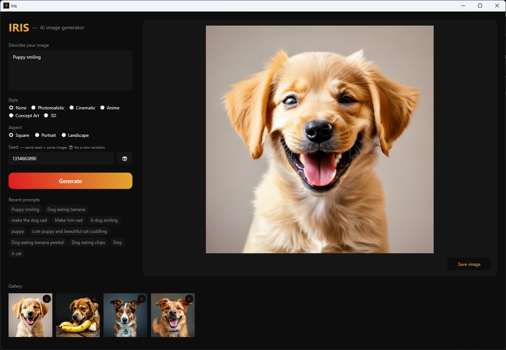

<!-- ============ HEADER BANNER ============ -->


<!-- ============ BADGES ============ -->
<p align="center">
  
  &nbsp;
  
  &nbsp;
  
  &nbsp;
  
</p>

<!-- ============ TAGLINE ============ -->
<p align="center">
  
</p>

<!-- divider -->


<!-- ============ ABOUT ============ -->
<h2 align="center"> About</h2>

<p align="center">
  <b>Iris</b> is a native Windows AI image generator built in <b>C# / WPF</b>. Type a prompt, choose a style,
  and get a real AI-generated image in seconds — saved automatically to a local gallery.
</p>

<p align="center">
  <b>No account. No API key. No billing.</b> Iris generates images through <b>Pollinations.ai</b> (keyless),
  so it works the moment you open it. Dark, minimal UI in a crimson &amp; gold brand — no Electron, just native WPF.
</p>

<!-- divider -->


<!-- ============ PREVIEW ============ -->
<h2 align="center">🖼️ Preview</h2>

<p align="center">
  
</p>

<!-- divider -->


<!-- ============ FEATURES ============ -->
<h2 align="center">✨ Features</h2>

<p align="center">
🎨 &nbsp;<b>Prompt → image</b> — real AI generation, keyless, in seconds<br/><br/>
🖌️ &nbsp;<b>Style presets</b> — Photorealistic · Cinematic · Anime · Concept Art · 3D<br/><br/>
🖼️ &nbsp;<b>Aspect presets</b> — Square · Portrait · Landscape<br/><br/>
🎲 &nbsp;<b>Seed control</b> — lock a seed to reproduce, or randomize for variations<br/><br/>
🗂️ &nbsp;<b>Local gallery</b> — every generation saved with its prompt, style, size &amp; seed; browse, open, delete<br/><br/>
🕘 &nbsp;<b>Prompt history</b> — one click to re-run a recent prompt<br/><br/>
💾 &nbsp;<b>Save / export</b> — write any result to disk<br/><br/>
🌑 &nbsp;<b>Native &amp; dark</b> — WPF, no Electron, crimson &amp; gold brand
</p>

<!-- divider -->


<!-- ============ TECH STACK ============ -->
<h2 align="center">🧰 Tech Stack</h2>

<p align="center">
  
</p>
<p align="center">
  <b>C# · .NET 8 · WPF · CommunityToolkit.Mvvm · System.Text.Json · xUnit</b>
</p>

<!-- divider -->


<!-- ============ HOW IT WORKS ============ -->
<h2 align="center">⚙️ How It Works</h2>

<p align="center">
  Iris composes your prompt with the selected style keywords, then requests an image from Pollinations'
  keyless endpoint:
</p>

```
GET https://image.pollinations.ai/prompt/{prompt}?width={w}&height={h}&seed={seed}&nologo=true&model=sana
```

<p align="center">
  The returned JPEG is shown, auto-saved to <code>%APPDATA%/Iris/</code>, and added to the gallery. All the
  logic — URL building, prompt composition, and the gallery/history stores — lives in <b>Iris.Core</b> with
  zero UI dependencies, which is what makes it unit-testable.
</p>

<!-- divider -->


<!-- ============ GETTING STARTED ============ -->
<h2 align="center">🚀 Getting Started</h2>

<p align="center"><b>Prerequisites:</b> .NET 8 SDK · Windows</p>

```bash
# Run
dotnet run --project Iris.App

# Test
dotnet test

# Publish a runnable Windows build
dotnet publish Iris.App -c Release -r win-x64 --self-contained false
#   → Iris.App/bin/Release/net8.0-windows/win-x64/publish/Iris.App.exe
```

<!-- divider -->


<!-- ============ TESTS ============ -->
<h2 align="center">🧪 Tests</h2>

<p align="center">
  The pure logic in <b>Iris.Core</b> is covered by <b>xUnit</b> — no network, deterministic, fast.
</p>

```bash
dotnet test
```

<p align="center">
  <b>28 tests</b> across the Pollinations URL builder, prompt composition, style/aspect maps,
  <code>GalleryStore</code>, <code>HistoryStore</code>, and the <code>MainViewModel</code> generate flow.
</p>

<!-- divider -->


<!-- ============ ARCHITECTURE ============ -->
<h2 align="center">🏗️ Architecture</h2>

```
Iris.Core   — models, PromptComposer, PollinationsClient, GalleryStore, HistoryStore   (tested)
Iris.App    — WPF, MVVM (CommunityToolkit.Mvvm), dark brand theme
Iris.Tests  — xUnit over Iris.Core + the ViewModel
```

<!-- divider -->


<!-- ============ DISCLAIMER ============ -->
<h2 align="center">⚖️ Disclaimer</h2>

<p align="center">
  Iris is an independent, open-source project. It is <b>not affiliated with, endorsed by, or associated with</b>
  Pollinations or any model provider. Generated images come from a third-party service and are subject to that
  service's availability and terms. Provided for personal and educational use.
</p>

<p align="center">
  <sub>© 2026 Anas Ben Ahmed · Provided "as is", without warranty of any kind.</sub>
</p>

<!-- ============ FOOTER WAVE ============ -->

